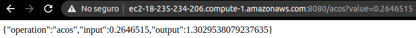
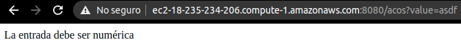
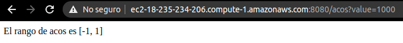
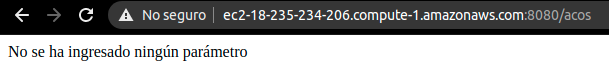

# Calculadora matemática

<!--[](https://app.circleci.com/pipelines/github/danielrincon-m/AREP_LAB4) -->
<!-- [](https://nanospring.herokuapp.com/nspapp/register) -->

## Descripción 🧮

Rn este parcial se desarrolló una calculadora matemática que por medio de una API, calcula las operaciones de ACOS(x) y ASIN(x), en donde x es un número en el rango [-1, 1] para ambos casos. A continuación veremos la implementación y el funcionamiento de la calculadora.


## Implementación 💻

La implementación fué realizada en el lenguaje Java con un servidor Spark Java, el cual publica la API y se encarga de recibir y de procesar las peticiones, como respuesta, retorna un objeto en formato JSON, con la operación que se realizó, la entrada del usuario y la salida de la operación.

### API

El API se compone de dos operaciones GET:

- **/acos**: recibe un valor en el rango [-1,1] y retorna el arcocoseno del valor.
- **/asin**: recibe un valor en el rango [-1,1] y retorna el arcoseno del valor.

Las peticiones deben ser de la forma: /acos?value=3.141592, si no se pone el parámetro o no es entendible como un número decimal, la aplicación retornará un mensaje de error.

### Despliegue de contenedores en AWS

Gracias a que subimos nuestro contenedor a DockerHub, fué muy sencillo ejecutarlo en nuestra máquina virtual en AWS, acá podremos ver el resultado:


Para hacer funcionar el proyecto en AWS, navegaremos a la dirección IP del servidor en el puerto 8080, y utilizaremos la API de la forma en la que se definió arriba.

En nuestro caso, la dirección es: http://ec2-18-235-234-206.compute-1.amazonaws.com:8080/

## Resultado ✔️

Gracias a que mapeamos el puerto de Spark Java al puerto público 8080, y modificamos las reglas del firewall de nuestra máquina para que este puerto sea accesible desde cualquier lugar, podemos ver la operación en las siguientes imágenes:




Como pudimos observar, la API funciona correctamente, e incluso retorna mensajes de error cuando se encuentra con una entrada inesperada:





## Video demostrativo 📼

El video de demostración puede ser encontrado [aquí](vid/../demostracion.mp4).

## Descarga del proyecto 📥

Clone el proyecto utilizando el siguiente comando:

```
git clone https://github.com/danielrincon-m/AREP_PARCIAL2.git
```

## Correr las pruebas unitarias 🧪

### Prerrequisitos

Un IDE que soporte proyectos Java, o una instalación de Maven en su sistema, puede obtenerlo desde
la [página oficial.][mvnLink]

### Ejecución de pruebas

Las pruebas pueden ser ejecutadas desde la sección de pruebas de su IDE o si tiene maven puede navegar a la carpeta
principal de cada uno de los dos proyectos internos y ejecutar el comando

```
mvn test
```

## Documentación del código fuente 🌎

La documentación de los proyectos puede ser encontrada en la carpeta [docs](docs).

También puede ser generada con Maven, clonando el proyecto y ejecutando el siguiente comando:

```
mvn javadoc:javadoc
```

## Herramientas utilizadas 🛠️

* [Visual Studio Code](https://code.visualstudio.com/) - IDE de desarrollo
* [Maven](https://maven.apache.org/) - Manejo de Dependencias
* [JUnit](https://junit.org/junit4/) - Pruebas unitarias
* [GitHub](https://github.com/) - Repositorio de código
* [Spark Java](https://sparkjava.com/) - Servidor Web
* [Docker](https://www.docker.com/) - Herramienta de encapsulamiento en contenedores
* [AWS](https://aws.amazon.com/es/) - Despliegue en la nube

## Autor 🧔

**Daniel Felipe Rincón Muñoz:** *Planeación y desarrollo del proyecto* -
[Perfil de GitHub](https://github.com/danielrincon-m)

## Licencia 🚀

Este proyecto se encuentra licenciado bajo **GNU General Public License** - consulte el archivo [LICENSE.md](LICENSE.md)
para más detalles.

<!-- 
## Acknowledgments 

* Hat tip to anyone whose code was used
* Inspiration
* etc
-->

[gitLink]: https://git-scm.com/downloads
[mvnLink]: https://maven.apache.org/download.cgi
